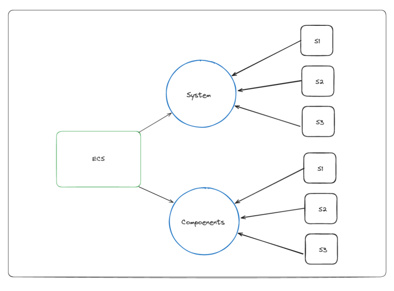

# Documentation ECS

## Description

This is the documentation for the ECS (Entity-Component-System) architecture used in the R-Type project. This architecture is a way to design the game. The game is divided into entities, components, and systems. The entities are the objects in the game, the components are the data of the entities, and the systems are the logic of the game.

## Entity

The entity is the object in the game. The entity is a simple integer that is used to identify the object. The entity is used to link the components and the systems together. The entity is used to identify the object in the game.

## Component

Components are the data associated with entities. Each component holds specific data that defines the properties or state of an entity. Components are plain data structures and do not contain any logic.

## System

Systems contain the logic of the game. They operate on entities that have specific components. Systems are responsible for updating the game state by processing entities and their components. Each system implements the `ISystem` interface and defines the `update` method.

## Modules

Modules are dynamic libraries that can be loaded at runtime. They contain implementations of systems and other game logic. The `Registry` class is responsible for loading these modules and managing the systems within them.

## Building the ecs

The ecs is build using a configuration file that contains the list of modules to load, all the components and different type of entities. During the build, the ecs will load all the modules and create the systems.

You can find more information about the build process in GameConfDoc §§§§§§§§§§§

## Running the ecs

The ecs is run by calling the `run` method of the `Registry` class. This method will call the `update` method of all the systems in the game. The `update` method will update the game state by processing entities and their components.

## Adding new features

### Adding a new component

To add a new component, you need to create a new structure that holds the data of the component. The structure should contain the data that defines the properties or state of the entity.

for example:

```cpp
struct Position {
    float x;
    float y;
};
```

### Adding a new system

To add a new system, you need to create a new class that implements the `ISystem` interface. The class should define the `update` method that contains the logic of the system.

for example:

```cpp
class HealthSystem : public ISystem {
    public:
        void update(Registry &r) {
            # update the health of entities
        }
};
```

the system should be added to a module through the `get_systems` function.

### Adding a new module

To add a new module, you need to create a new dynamic library that contains the implementation of the systems. The module should define the `get_systems` function that returns a vector of systems.

for example:

```cpp
class module_graphique : public IModule {
    public:
        module_graphique() = default;
        ~module_graphique() = default;


        std::vector<std::function<void(Registry&)>> get_systems() {
            # return a vector of systems
        }
};
```

this module should have 2 extern "C" functions to create and import the module.

for example:

```cpp
extern "C" {
    module_graphique *create_class_instance() {
        return new module_graphique();
    }

    std::vector<std::function<void(Registry&)>> get_systems() {
        return module_graphique().get_systems();
    }
}
```
